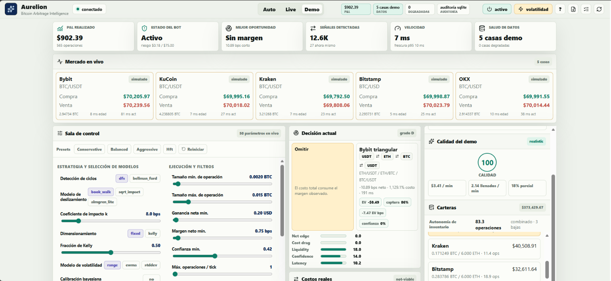
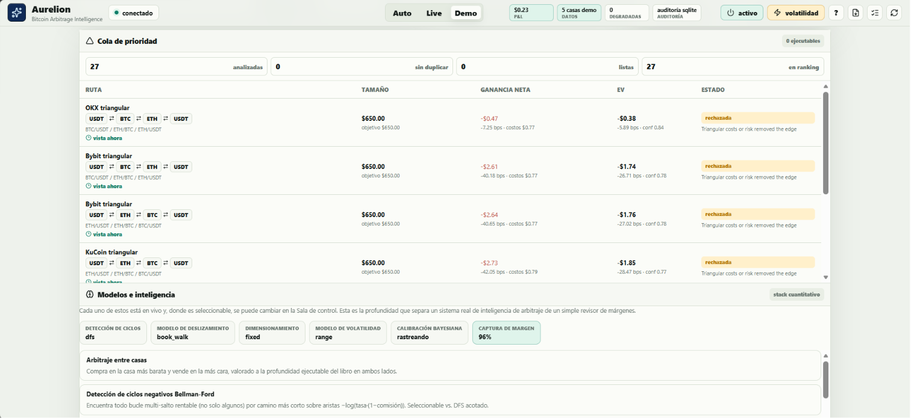
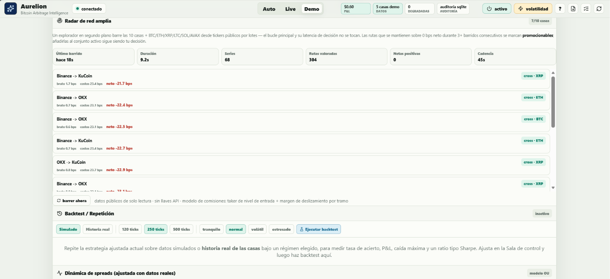
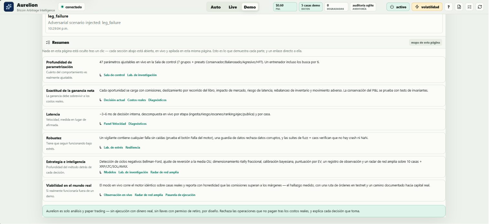

<div align="center">

# Aurelion

### Inteligencia de arbitraje de Bitcoin — CODING CHALLENGE MÉXICO

Creado por **Victor Ruiz**

[](https://www.python.org/)
[](https://fastapi.tiangolo.com/)
[](https://react.dev/)
[](https://vite.dev/)

</div>

---

## Qué es Aurelion

Aurelion monitorea libros de órdenes en varios exchanges en tiempo real, detecta arbitraje
cross-exchange, triangular y ciclos dinámicos de 4 pasos, prioriza las rutas por **valor
esperado** (no por spread bruto), simula la ejecución con costos realistas, y muestra todo
el proceso — decisión, costos, riesgo — en un dashboard auditable.

```text
datos de mercado -> libros normalizados -> motores de arbitraje -> score de valor esperado
-> cola de prioridad -> compuertas de riesgo -> ejecución simulada -> auditoría durable
```

No finge que cualquier spread es una ganancia: cada oportunidad se cobra comisiones reales
del venue, slippage por profundidad de libro, impacto de mercado, riesgo de latencia y
movimiento adverso — y el sistema **se niega a operar** cuando esos costos superan el edge.

**Repositorio:** https://github.com/rvvictor/Challenge-CODING-CHALLENGE-MEXICO

<div align="center">





</div>

---

## Capacidades principales

| Área | Qué hace |
| --- | --- |
| **Motores de arbitraje** | Cross-exchange BTC, triangular clásico y ciclos dinámicos de 4 pasos (`USDT→BTC→ETH→SOL→USDT`), sobre 10 exchanges y BTC/ETH/XRP/LTC/SOL/AVAX. |
| **Modelo de costos** | Comisión taker por venue (nivel de entrada, sin descuentos), slippage por recorrido de libro, impacto de mercado (√-law / Almgren), riesgo de latencia y movimiento adverso post-decisión. |
| **Valor esperado** | Rankea por EV = utilidad neta × confianza − riesgo de latencia − riesgo de volatilidad − penalización de inventario. Deduplica rutas equivalentes. |
| **Modelos seleccionables** | Bellman-Ford (todos los ciclos rentables) vs. DFS acotado; impacto `book_walk`/`sqrt_impact`/`almgren_lite`; sizing fijo vs. Kelly fraccional; volatilidad `range`/`ewma`/`stddev`; calibración bayesiana por venue. Todos ajustables en vivo. |
| **Control Room** | **50 parámetros** en vivo (9 grupos) con presets Conservative/Balanced/Aggressive/HFT — cambios se aplican al siguiente tick, sin reiniciar. |
| **Riesgo y resiliencia** | Circuit breaker (volatilidad, datos stale, rachas de pérdida, presupuesto horario), feed guard contra libros envenenados, watchdog que contiene fallas del motor sin caerse, exposición máxima abierta. |
| **Research Lab** | Ajusta un modelo de reversión a la media (Ornstein-Uhlenbeck) sobre spreads reales; entrena parámetros repitiendo el mercado por los mismos motores (estilo *hyperopt*) con validación fuera de muestra. |
| **Validación estadística** | Corre el motor sobre varias ventanas de mercado independientes y reporta un **intervalo de confianza bootstrap** y una **prueba de significancia** sobre si el edge es real después de costos — no una sola corrida, una conclusión con matemática detrás. |
| **Wide-Net Radar** | Barre los 10 exchanges + XRP/LTC/SOL/AVAX en segundo plano (datos públicos, sin afectar la latencia del loop caliente) y mide cuánto sobrevive cada ruta tras comisiones. |
| **Camino a real** | `paper → read-only-live → testnet (sandbox, dinero falso) → capital real (futuro, revisado)`. El gateway de testnet coloca órdenes reales en sandbox con llaves *solo de trading*; nunca llaves con permiso de retiro. |
| **Auditoría** | Ledger durable (SQLite/Postgres) con retención automática, exportación de sesión, continuidad entre reinicios, reporte HTML autocontenido para revisión. |
| **Co-piloto de IA** | Explica la decisión actual en lenguaje simple y breve; usa Claude si hay `ANTHROPIC_API_KEY`, si no, una explicación determinística — funciona sin llave. |

---

## Por qué en `auto`/`live` casi no hay ganancias — y qué estamos haciendo al respecto

**Esto es intencional y medido, no un defecto.** El motor es idéntico en los tres modos; lo
único que cambia es la fuente de datos:

- **`demo`** usa un simulador determinístico que inyecta dislocaciones rentables de forma
  controlada, para mostrar *toda* la funcionalidad (ejecuciones, ciclos triangulares,
  recuperación de fallas parciales, stress lab) en el tiempo de una evaluación.
- **`auto`/`live`** corre el mismo motor sobre **datos reales de mercado**. Ahí el hallazgo
  medido — por el Wide-Net Radar, el modelo de spreads OU y el grabador de observación en
  vivo — es que **casi ninguna ruta sobrevive los costos reales**: comisiones taker (10–120
  bps según el venue), slippage, impacto de mercado y latencia consumen el spread antes de
  que se pueda capturar. Los mejores edges observados rondan **−20 bps netos** en BTC/ETH; las
  alts (XRP/LTC/SOL/AVAX) tampoco alcanzan a cubrir el nivel de comisión de entrada. El bot
  entonces se niega a operar — eso es la disciplina funcionando, no una falla.

**Por qué pasa:** los pares mayores entre exchanges grandes son extremadamente eficientes; la
literatura (Kaiko 2025, Makarov & Schoar 2020) documenta ventanas de arbitraje real de
segundos, no minutos, y sin ventaja de latencia de colocation, ese margen ya se cerró para
cuando cualquier bot basado en API pública puede reaccionar.

**Qué estamos haciendo para acercarnos a la realidad, en vez de solo afirmarlo:**

1. **Research Lab** ajusta el modelo OU sobre historial real por par de venues — mide cuánto
   duran las dislocaciones, con qué frecuencia aparecen y qué fracción desaparece antes de
   poder ejecutarse, en vez de asumirlo.
2. **Entrenador de parámetros** repite el mercado por los mismos motores muchos veces
   (patrón *hyperopt*) y valida el mejor preset sobre una realización de mercado
   independiente, para detectar sobreajuste.
3. **Motor de validación estadística** (`GET /api/validation`, nuevo) va un paso más allá:
   corre varias ventanas fuera de muestra, agrupa cada operación realizada y calcula un
   intervalo de confianza bootstrap y una prueba de significancia (¿la media por operación es
   distinguible de cero después de costos?) sobre el resultado agrupado. La conclusión es
   honesta y cuantificada — en datos reales, hoy, típicamente reporta **"sin datos
   suficientes / edge no positivo"**, exactamente porque las oportunidades no cruzan el muro
   de comisiones; en el simulador de demo reporta correctamente **"edge positivo"**, porque ahí
   sí está diseñado para pagar. Esa diferencia es la prueba de que el sistema no infla resultados.
4. **Wide-Net Radar** vigila continuamente los 10 exchanges + 4 alts en busca de una ruta que
   sí cruce el muro, y marca cualquier hallazgo persistente como candidato a promoción —
   la promoción a el carril rápido queda como decisión humana, no automática.
5. **Camino documentado a capital real**: `testnet` (sandbox, dinero falso) ya funciona hoy;
   el checklist completo para graduar a capital pequeño está en
   [`docs/SECURITY-live-readiness.md`](docs/SECURITY-live-readiness.md). Dinero real
   **no está implementado ni habilitado**.

---

## Stack técnico

| Capa | Tecnología |
| --- | --- |
| Backend | Python 3.11+, FastAPI, Uvicorn, asyncio |
| Datos de mercado | `ccxt.pro` (WebSocket) con respaldo `ccxt` REST |
| Frontend | React 19, Vite 7, lucide-react (Node 20+) |
| Tiempo real | Server-Sent Events, con snapshot REST como respaldo |
| Persistencia | SQLite local (por defecto) o Postgres vía `DATABASE_URL`, con retención automática |
| Mensajería | Redis Pub/Sub opcional |
| IA | Claude (Anthropic) opcional para el co-piloto; funciona sin llave |

### Decisiones de arquitectura y por qué

| Decisión | Por qué, en vez de la alternativa obvia |
| --- | --- |
| Un solo proceso `asyncio`, sin cola de tareas ni workers | El tick del motor, el broadcast SSE y la API viven en el mismo loop de eventos; a la latencia objetivo (~3–6 ms de decisión) coordinar procesos separados (Celery, RQ) añadiría más overhead del que resuelve para un solo dashboard en vivo. |
| Server-Sent Events, no WebSocket, hacia el navegador | El flujo dashboard→navegador es unidireccional; SSE trae reconexión nativa vía `EventSource` sin lógica propia de heartbeat/reintento. Las acciones que sí mutan estado (`/api/control`, `/api/params`) van por POST normal, no por el socket. |
| `ccxt.pro` (WebSocket) con caída a `ccxt` REST | Suscripción en vivo cuando el venue/red lo permite; si el WS falla o el entorno lo bloquea, cae a polling REST sin tumbar el proceso — el modo `auto` reporta esa degradación en vez de ocultarla. |
| SQLite por defecto, Postgres opcional vía `DATABASE_URL` | Cero configuración para correr o evaluar localmente; el mismo código de persistencia funciona contra Postgres sin cambios cuando se necesita concurrencia o durabilidad real. |
| Estado del motor en memoria + auditoría durable aparte | Las decisiones de arbitraje no pueden esperar una escritura a disco; el ledger durable se escribe fuera del loop caliente (`asyncio.to_thread` para las rutas costosas) y se auto-poda (ver Despliegue) para no crecer sin límite. |
| Techo de ejecución en `testnet` (sandbox, dinero falso) | Decisión de seguridad, no de alcance técnico: no existe una ruta de código hacia dinero real ni llaves con permiso de retiro. Ver [`docs/SECURITY-live-readiness.md`](docs/SECURITY-live-readiness.md) para el checklist explícito de qué faltaría, y quién lo aprobaría, para graduar a capital real. |

---

## Instalación y ejecución local

```bash
git clone https://github.com/rvvictor/Challenge-CODING-CHALLENGE-MEXICO.git
cd Challenge-CODING-CHALLENGE-MEXICO

python -m pip install -r requirements.txt
npm --prefix frontend install
npm run build
npm run dev
```

Abrir `http://localhost:8000` (si la terminal muestra `0.0.0.0:8000`, es solo la interfaz de
escucha del servidor — usar `localhost` en el navegador).

```bash
npm run check     # compila el backend y construye el frontend
npm run test      # suite de pruebas del backend (unittest)
```

**Cobertura de pruebas:** 142 pruebas (`unittest`) en 26 clases — motores de arbitraje y scoring,
registro de parámetros, modelos cuantitativos seleccionables, backtest y aprendizaje, retención de
persistencia, Stress Lab, co-piloto, seguridad del token de control, pasarela de ejecución
(paper/testnet), contabilidad multi-activo, radar de red amplia, Research Lab, robustez ante datos
corruptos/fuzzing, y el motor de validación estadística. Corren contra el mismo código que sirve el
dashboard — no hay una versión "de prueba" separada del motor real.

---

## Despliegue (Render)

```text
Comando de build: pip install -r requirements.txt && npm --prefix frontend ci && npm --prefix frontend run build
Comando de inicio: python -m backend.app.main
```

Variables mínimas recomendadas:

```text
MARKET_MODE=demo
AUTO_EXECUTION=true
EXCHANGE_PROFILE=speed
EVALUATION_INTERVAL_MS=450
```

**Sobre el disco en planes con almacenamiento limitado:** el almacén durable se auto-poda
(`PERSISTENCE_RETENTION_HOURS`, por defecto 24h, y `PERSISTENCE_MAX_ROWS`, por defecto 50 000
filas — lo que se cumpla primero) para que nunca crezca sin límite. En un disco muy pequeño,
bajar ambos valores (p. ej. `PERSISTENCE_RETENTION_HOURS=6`, `PERSISTENCE_MAX_ROWS=10000`) o
apagar la persistencia por completo con `PERSISTENCE_ENABLED=false` — el dashboard en vivo
sigue funcionando igual, solo se pierde el historial entre reinicios. Ver `.env.example` para
la lista completa de variables.

---

## Modos de ejecución

| Modo | Qué hace |
| --- | --- |
| `demo` | Simulador determinístico. Recomendado para evaluación: visual, rápido, sin dependencias externas. |
| `auto` | Intenta datos reales; se degrada de forma segura al simulador si el entorno bloquea exchanges. |
| `live` | Datos reales de mercado. La ejecución sigue siendo paper/testnet — nunca dinero real por defecto. |

---

## Estructura del proyecto

```text
backend/app/
  main.py                    FastAPI: API, SSE, exportación, SPA
  core/                      config.py (settings + catálogo), models.py (dominio)
  engines/                   arbitrage · triangular · queue · scoring · execution · ledger
                              risk · simulator · venue_health · edge_analysis · discovery
                              backtest · validation · statistics · autotune · report
  integrations/               ccxt_provider · persistence · redis_bus · gateways · llm_narrator
backend/tests/test_engines.py Suite de pruebas (142+)

frontend/src/
  main.jsx                   Cockpit React
  styles/app.css              Sistema visual y layout

docs/                         Arquitectura, seguridad live, hallazgos de investigación
```

---

## API (resumen)

| Endpoint | Qué devuelve |
| --- | --- |
| `GET /api/snapshot`, `GET /events` (SSE) | Estado completo del dashboard, en vivo. |
| `GET /api/health`, `GET /api/config` | Estado mínimo del proceso; configuración activa (riesgo, exchanges, cadencia). |
| `GET/POST /api/params` | Registro de parámetros, valores, presets; aplica cambios en vivo. |
| `GET /api/execution` | Estado de la pasarela de ejecución (paper/testnet) y sus capacidades. |
| `GET /api/backtest` | Replay determinístico (simulado o historial real) con hit rate, drawdown, Sharpe-like. |
| `GET /api/validation` | Validación estadística del edge: CI bootstrap + prueba de significancia sobre varias ventanas. |
| `GET /api/research/spread`, `POST /api/research/autotune` | Ajuste de modelo OU y entrenador de parámetros. |
| `GET /api/discovery`, `POST /api/discovery/sweep` | Radar de red amplia. |
| `GET /api/observation` | Grabador de observación en vivo (frecuencia, tasa de captura por ruta). |
| `POST /api/scenario` | Inyecta un escenario del Stress Lab. |
| `GET /api/narrate`, `GET /api/narrate/stream` | Co-piloto de IA. |
| `GET /api/export/report`, `GET /api/export/session` | Reporte HTML autocontenido / export JSON completo. |
| `GET /api/continuity`, `GET /api/replay` | Continuidad e historial desde el almacén durable. |
| `POST /api/control`, `POST /api/reset` | Cambia modo/exchanges/ejecución; reinicia la sesión. |
| `GET /metrics` | Métricas estilo Prometheus. |

Todos los endpoints que mutan estado aceptan `CONTROL_TOKEN` opcional (`X-Aurelion-Token`) y
comparten un rate limit por cliente.

---

## Notas de modelado (transparencia cuantitativa)

- **Comisiones**: nivel de entrada publicado por cada venue (julio 2026), sin descuentos por
  volumen — deliberadamente conservador; un bot siempre activo alcanzaría mejores niveles.
- **Impacto de mercado**: `book_walk` valora la profundidad visible; `sqrt_impact`/`almgren_lite`
  añaden el costo de empujar el precio más allá del libro.
- **Latencia**: costo de riesgo por latencia promedio de la pierna; probabilidad de captura
  por decaimiento exponencial de half-life — simplificaciones declaradas.
- **Modelo de spreads (OU)**: resolución de una vela (1 min); la ventana real de arbitraje es
  de segundos (Kaiko 2025), así que las duraciones reportadas son cotas superiores.
- **Triangular**: el P&L neto se acredita a USDT; el inventario intermedio de la ruta no se
  mueve físicamente — una simplificación declarada, no un error de contabilidad del cross-exchange
  (ese sí conserva BTC exactamente).

---

## Documentación técnica adicional

El README cubre lo esencial; estos documentos entran en el detalle que un README no debería
cargar:

| Documento | Contenido |
| --- | --- |
| [`docs/architecture/ArchitectureReview.md`](docs/architecture/ArchitectureReview.md) | Revisión de arquitectura de 100% del código fuente desde seis ángulos (arquitecto, backend, quant, trading, seguridad, DevOps): fortalezas, debilidades, riesgos, deuda técnica y comparación explícita contra los criterios del challenge. |
| [`docs/architecture/ResearchLabFindings.md`](docs/architecture/ResearchLabFindings.md) | Corrida real del Research Lab sobre datos de mercado en vivo — los números detrás de "casi no hay ganancias en auto/live" (vida media de dislocaciones, frecuencia, cuántas superan el muro de comisiones), con método y fuentes citadas para que sean reproducibles, no anecdóticos. |
| [`docs/architecture/RoadmapAndRealWorldPath.md`](docs/architecture/RoadmapAndRealWorldPath.md) | Plan hacia adelante: qué está hecho, qué falta para un panel quant-aware, y el camino explícito hacia operar con datos/capital real. |
| [`docs/SECURITY-live-readiness.md`](docs/SECURITY-live-readiness.md) | Runbook de seguridad: el camino etapa por etapa (observación → paper-live → testnet → capital real) y el checklist exacto que faltaría completar — hoy nada de eso está habilitado. |

---

## Notas importantes

- Aurelion es software de análisis, simulación y paper trading — **no ejecuta órdenes con
  dinero real ni incluye llaves con permiso de retiro**, por diseño.
- `ccxt.pro` se usa cuando está disponible; si no, cae a `ccxt` REST.
- Redis y Postgres son opcionales; el sistema funciona completo sin ninguno de los dos.
- El modo `demo` es la ruta recomendada para evaluación: determinística, visual e
  independiente de bloqueos de red.

---

## Autor

**Victor Ruiz** — Proyecto para **CODING CHALLENGE MÉXICO**
