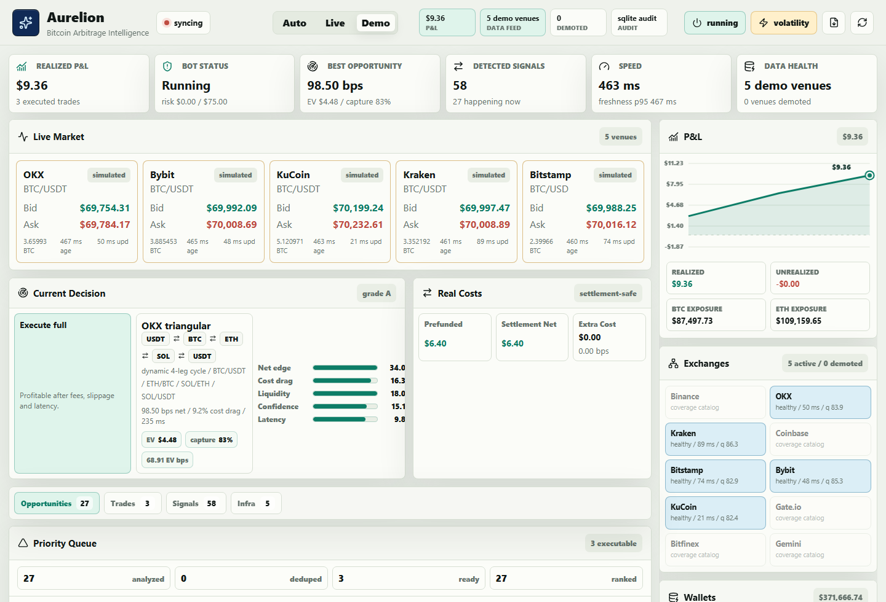
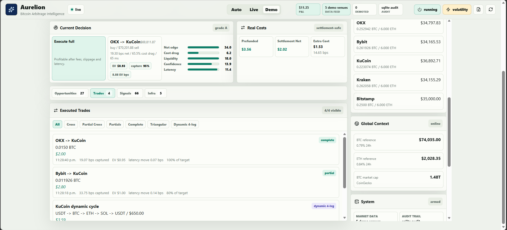

<div align="center">

# Aurelion

### Inteligencia de arbitraje de Bitcoin para el CODING CHALLENGE MEXICO

Creado por **Victor Ruiz**

[](https://www.python.org/)
[](https://fastapi.tiangolo.com/)
[](https://react.dev/)
[](https://vite.dev/)
[](https://redis.io/)
[](https://www.postgresql.org/)

</div>

---

## Descripción

**Aurelion** es un bot de arbitraje de Bitcoin construido con una arquitectura real de backend y frontend. El sistema monitorea libros de órdenes en múltiples exchanges, detecta oportunidades de arbitraje cross-exchange, triangular y ciclos dinámicos de 4 pasos, prioriza las mejores rutas con una cola basada en valor esperado, simula ejecuciones con costos realistas y muestra todo el proceso en un dashboard web claro, visual y auditable.

El objetivo del proyecto no es fingir que cualquier spread es ejecutable. Aurelion modela la cadena completa de decisión:

```text
datos de mercado -> libros normalizados -> motores de arbitraje -> score de valor esperado
-> cola de prioridad -> compuertas de riesgo -> validación de inventario
-> ejecución simulada -> auditoría durable -> dashboard en vivo
```

El proyecto fue diseñado para demostrar dominio técnico bajo presión: velocidad, razonamiento financiero, manejo de fallas, claridad visual, trazabilidad y código limpio.

Repositorio:

```text
https://github.com/rvvictor/Challenge-CODING-CHALLENGE-MEXICO
```

---

## Capturas de pantalla

### Vista principal del cockpit



### Vista operativa extendida



---

## Por qué Aurelion destaca

| Área | Qué hace Aurelion |
| --- | --- |
| Datos de mercado | Usa una estrategia **WebSocket-first** con `ccxt.pro` cuando está disponible. El polling REST solo se activa como respaldo después de fallas repetidas. |
| Robustez | Reintenta conexiones cada 2 segundos, activa REST después de 5 fallas de WebSocket y puede deshabilitar streams dañados sin romper el sistema. |
| Velocidad | El perfil por defecto opera con 5 exchanges rápidos para reducir latencia, pero mantiene un catálogo de 10 exchanges para cobertura. |
| Arbitraje | Detecta arbitraje cross-exchange de BTC, ciclos triangulares clásicos y ciclos dinámicos de 4 pasos como `USDT -> BTC -> ETH -> SOL -> USDT`. |
| Calidad de ejecución | Modela comisiones, slippage, impacto por retiros, riesgo de latencia, movimiento adverso de precio y penalización por inventario. |
| Priorización | La cola deduplica rutas equivalentes y ordena por valor esperado, confianza, liquidez y riesgo ajustado. |
| Riesgo | Incluye circuit breaker por volatilidad, datos stale, rachas de pérdidas y presupuesto de riesgo por hora. |
| Auditoría | Mantiene historial en memoria y persistencia opcional con Postgres o SQLite local. |
| Interfaz | Dashboard enfocado en P&L, velocidad, salud de exchanges, decisión actual, mercado vivo, señales y trades ejecutados. |
| Demo realista | Simulador determinístico con shocks controlados para mostrar trades normales, parciales, triangulares y dinámicos sin ganancias absurdas. |
| Parametrización en vivo | **Control Room** con 37 parámetros ajustables en tiempo real y presets (Conservative/Balanced/Aggressive/HFT). |
| Modelos seleccionables | Bellman-Ford, impacto de mercado raíz cuadrada, sizing por Kelly y volatilidad EWMA, intercambiables en vivo. |
| Backtesting y aprendizaje | Replay determinístico con métricas (hit rate, drawdown, Sharpe) y autocalibración bayesiana por venue. |
| Robustez demostrable | **Stress Lab** de escenarios adversos y conciliación de órdenes parciales/fallidas con corrección de exposición. |
| Co-piloto de IA | Explicación consultiva en lenguaje claro de cada decisión, con respaldo determinístico sin llave. |

---

## Stack tecnológico

| Capa | Tecnología |
| --- | --- |
| Backend API | Python, FastAPI, Uvicorn |
| Datos de mercado | `ccxt.pro` para WebSockets cuando está instalado, `ccxt.async_support` para respaldo REST |
| Frontend | React 19, Vite, lucide-react |
| Tiempo real | Server-Sent Events con snapshot REST como respaldo |
| Mensajería | Redis Pub/Sub opcional |
| Persistencia | Postgres mediante `DATABASE_URL`, SQLite local como respaldo |
| Pruebas | `unittest` en Python, pruebas de motores y verificación de build del frontend |
| Despliegue | Servicio web Python capaz de ejecutar FastAPI y construir React |

---

## Funciones principales

### 1. Datos de mercado WebSocket-first

Aurelion intenta usar `ccxt.pro` para recibir libros de órdenes en vivo por WebSocket. Si `ccxt.pro` no está disponible, el sistema puede operar con `ccxt.async_support` como respaldo REST cuando sea posible.

Cada stream mantiene su propio estado:

- `websocket`: modo principal.
- `rest`: modo de respaldo, activado solo después de 5 fallas consecutivas.
- `disabled`: estado seguro cuando REST también falla repetidamente.
- `healthScore`: puntaje automático que baja cuando hay errores o latencia alta.

El proveedor también usa límites seguros por exchange para evitar errores conocidos en KuCoin, Kraken, Bybit y Bitfinex cuando rechazan profundidades no soportadas.

### 2. Motores de arbitraje

Aurelion detecta:

- **Arbitraje cross-exchange de BTC**: comprar BTC en un exchange y venderlo en otro.
- **Arbitraje triangular clásico**: por ejemplo `USDT -> BTC -> ETH -> USDT`.
- **Ciclos dinámicos de 4 pasos**: por ejemplo `USDT -> BTC -> ETH -> SOL -> USDT`.
- **Near misses**: señales no ejecutables que explican qué tan cerca estuvo el mercado de ser rentable.

Cada oportunidad incluye edge neto, edge bruto, comisiones, slippage, riesgo de latencia, valor esperado, confianza, ratio de llenado y decisión de ejecución.

### 3. Cola de prioridad por valor esperado

La cola no ordena solamente por spread bruto. Aurelion calcula una aproximación de valor esperado:

```text
EV = utilidad_neta * confianza - riesgo_latencia - riesgo_volatilidad - penalización_inventario
```

También elimina duplicados:

- Si aparecen `Binance -> Kraken` y `Kraken -> Binance` en el mismo tick, conserva la ruta con mejor score ajustado.
- Si aparecen varias versiones de un mismo ciclo triangular, conserva la de mayor valor esperado.
- Las oportunidades rentables tienen prioridad sobre señales rechazadas o bloqueadas.

### 4. Simulador de ejecución

La capa de ejecución simula:

- fills completos;
- fills parciales;
- ciclos triangulares parciales;
- movimiento adverso de precio por latencia;
- rebalanceo virtual de inventario;
- P&L realizado;
- metadatos completos para dashboard y exportación.

El modo demo está calibrado para mostrar trades cross-exchange normales, parciales normales, oportunidades triangulares y señales dinámicas de 4 pasos sin producir resultados irreales.

### 5. Circuit breaker y control de riesgo

Aurelion pausa la ejecución cuando el riesgo deja de ser aceptable:

- shock de volatilidad en BTC dentro de la ventana configurada;
- 5 trades negativos consecutivos;
- libros de órdenes sin actualizar;
- presupuesto de pérdidas por hora excedido;
- prueba manual de volatilidad desde el dashboard.

Cuando el circuit breaker está activo, el sistema sigue observando el mercado, pero deja de ejecutar nuevos trades. Después del cooldown, se reactiva automáticamente.

### 6. Auditoría y trazabilidad

El runtime conserva eventos importantes de la sesión:

- oportunidades detectadas;
- trades ejecutados;
- eventos de riesgo;
- fallas de streams de mercado;
- serie de P&L;
- ledger de replay;
- exportación completa en JSON.

Si se configura `DATABASE_URL`, Aurelion escribe registros durables en Postgres. Si no hay Postgres, usa SQLite local para que el proyecto siga siendo fácil de correr durante la evaluación.

---

## Novedades de la fase final

Estas capacidades se agregaron para la fase final del challenge. Todas conservan el
marco paper-only y, por defecto, no alteran el comportamiento del demo: solo se
activan cuando el usuario las usa.

### Control Room: parametrización en vivo

El backend siempre tuvo decenas de parámetros, pero antes solo se ajustaban por
variables de entorno. Ahora **37 parámetros** (en 7 grupos) son ajustables **en
vivo** desde la pestaña *Control Room* del dashboard: tamaños de operación, edge
mínimo, confianza mínima, pesos del valor esperado, modelo de latencia, umbrales de
riesgo, parámetros triangulares, salud de venues y cadencia del motor. Hay presets
**Conservative / Balanced / Aggressive / HFT**, un botón de reset y un indicador de
qué cambió. Los motores leen la configuración en cada tick, así que un cambio se
aplica al siguiente ciclo sin reiniciar.

- Endpoints: `GET /api/params`, `POST /api/params` (updates, preset o reset).
- Seguridad: si se define `CONTROL_TOKEN`, los endpoints que mutan estado exigen el
  header `X-Aurelion-Token`.

### Modelos cuánticos avanzados (seleccionables)

Cada modelo es un **modo seleccionable** en el Control Room. Los valores por defecto
reproducen el comportamiento original; el jurado puede cambiarlos en vivo.

- **Detección de ciclos por Bellman-Ford** además del DFS acotado. Construye un grafo
  con peso `-log(tasa·(1−fees))` y detecta ciclos de suma negativa (todas las rutas
  rentables, no solo algunas). Ambos algoritmos alimentan la misma evaluación de
  ciclo, así que el P&L se calcula igual.
- **Modelo de impacto de mercado** (`book_walk` / `sqrt_impact` / `almgren_lite`):
  agrega el impacto de consumir profundidad (ley de raíz cuadrada y término
  temporal+permanente) como una línea de costo explícita sobre el recorrido del libro.
- **Sizing por Kelly fraccional** además del tamaño fijo: dimensiona según la calidad
  del edge (probabilidad de éxito × payoff), acotado a `MAX_TRADE_BTC`.
- **Volatilidad EWMA / desviación estándar** además del rango simple, para el circuit
  breaker.

### Backtesting y autocalibración bayesiana

- **Backtest / Replay** (`GET /api/backtest`): reproduce el mercado determinístico a
  través de **los mismos motores** usando una copia de los parámetros actuales y
  reporta hit rate, P&L total y promedio, **máximo drawdown**, un ratio tipo Sharpe y
  una curva de equity. Corre fuera del loop en vivo. Pestaña *Backtest* en el
  dashboard.
- **Autocalibración** (`engines/calibration.py`): mantiene una posterior
  Beta-Bernoulli de éxito de ejecución por venue, aprendida de los fills reales.
  Cuando se activa, multiplica la confianza de cada oportunidad, de modo que el bot
  confía menos en venues que fallan y los recupera cuando se normalizan. Panel
  *Self-calibration*.
- **Persistencia bidireccional**: el almacén durable ahora se puede leer; `/api/replay`
  responde desde la base de datos (con respaldo en memoria), así un reinicio ya no
  borra la sesión auditable.

### Stress Lab y manejo de órdenes parciales/fallidas

- **Stress Lab** (`POST /api/scenario`): escenarios adversos de un clic —
  *flash crash, liquidity crunch, latency spike, venue outage, leg failure*— para ver
  reaccionar al circuit breaker, a la salud de venues y a la conciliación de trades.
- **Conciliación de órdenes**: cada trade cross reporta lo previsto vs lo llenado por
  pierna, la **exposición abierta** y la **corrección** (cubrir el remanente a peor
  precio, con su costo) cuando se inyecta `leg_failure`. En condiciones normales el
  trade queda cubierto con exposición cero.
- **Autonomía de inventario**: el panel de wallets muestra cuántas operaciones más
  puede fondear cada venue (y el pool) antes de quedarse sin saldo útil.

### Co-piloto de IA (solo explicación)

Un panel *AI Co-pilot* explica en lenguaje claro **por qué** se toma o se descarta la
oportunidad actual, el estado del circuit breaker, los escenarios activos y los
modelos en uso. Es **estrictamente consultivo**: nunca decide ni ejecuta. Usa Claude
cuando hay `ANTHROPIC_API_KEY`; si no, usa una explicación determinística construida
con los mismos datos, de modo que funciona sin llave durante la evaluación. La llamada
corre fuera del loop en vivo.

### Radar de red amplia (descubrimiento en dos carriles)

Responde a la pregunta "¿y si el edge está en otro par u otro venue?" **sin pagar el
costo de latencia** de escanear 10 exchanges en el loop caliente:

- **Carril caliente** (sin cambios): los 5 venues más rápidos, BTC+ETH, decisiones en
  ~5 ms medidos por tick.
- **Carril de descubrimiento** (nuevo): un scout en segundo plano barre **todo el
  universo de 10 exchanges** más pares **XRP, LTC y SOL** usando una sola petición
  batched de tickers públicos por venue (paralelizada por hilos). Valora cada ruta
  cross-exchange y triangular con el **mismo catálogo de comisiones entry-tier**, y
  registra cuántos barridos consecutivos sobrevive cada edge. Una ruta que persiste
  por encima del umbral se marca **promotable**: evidencia de que ese venue/par
  merece un lugar en el carril caliente. La promoción es decisión humana.
- Pestaña *Wide-Net Radar* en el workbench; datos públicos read-only, sin llaves.
- Endpoints: `GET /api/discovery`, `POST /api/discovery/sweep` (con auth opcional).
- 4 parámetros nuevos en el Control Room (grupo *Wide-net discovery*): encendido,
  cadencia, umbral de edge y racha de promoción.
- Universo de pares: XRP y LTC (primera canasta de las respuestas al comité),
  SOL y AVAX (segunda canasta), más BTC/ETH como referencia.

### Laboratorio de investigación y entrenamiento

La fase de observación descrita en las respuestas al comité —medir cuánto duran
las oportunidades, qué porcentaje desaparece antes de poder ejecutarse y qué
rutas se deterioran— ahora está implementada como una pestaña *Research Lab*
con dos capacidades:

- **Modelo de dinámica de spreads (ajustado a datos reales)**: ajusta un proceso
  de reversión a la media (**Ornstein-Uhlenbeck**, en su forma discreta AR(1) con
  OLS de forma cerrada, sin dependencias de ML) al spread entre cada par de
  venues usando historial OHLCV real. Reporta por par: **half-life** de las
  dislocaciones, sigma estacionaria, **episodios de dislocación por hora**, su
  **duración mediana**, el **porcentaje que desaparece en menos de una vela** y
  si algún episodio superó el muro de comisiones entry-tier. Marco teórico:
  Bertram (2010), umbrales óptimos de arbitraje estadístico para procesos OU.
- **Entrenador de parámetros**: búsqueda aleatoria con semilla sobre el registro
  del Control Room, evaluada re-ejecutando el mercado a través de **los mismos
  motores** vía el backtest (el patrón *hyperopt* de freqtrade, el bot open
  source más usado). El trial 0 siempre es la configuración actual, así que la
  mejora es comparable uno a uno. Objetivo: `totalPnl − 0.5·maxDrawdown`. El
  preset aprendido se aplica por `/api/params` como cualquier cambio manual:
  visible en el Control Room, auditable en el edge ledger y reversible.
- Endpoints: `GET /api/research/spread`, `POST /api/research/autotune` (auth
  opcional). Ambos corren fuera del loop en vivo.

---

## Para el jurado

Ruta recomendada de evaluación (modo demo, determinístico):

1. Iniciar: `npm run dev` y abrir `http://localhost:8000`.
2. **Control Room**: mover *Min net edge* o aplicar el preset *Aggressive* y ver cómo
   cambian las oportunidades aceptadas/rechazadas en vivo.
3. **Strategy & model selection**: cambiar *Cycle detection* a `bellman_ford`,
   *Slippage model* a `sqrt_impact`, *Position sizing* a `kelly`.
4. **Backtest**: correr un replay y leer hit rate, drawdown y ratio tipo Sharpe de la
   estrategia recién ajustada.
5. **Stress Lab**: inyectar *Venue outage* o *Liquidity crunch* y observar el circuit
   breaker; inyectar *Leg failure* y revisar la conciliación en *Executed Trades*.
6. **AI Co-pilot**: pedir la explicación de la decisión actual.
7. **Wide-Net Radar**: ver el barrido real de 10 exchanges + XRP/LTC/SOL/AVAX
   (datos públicos en vivo) y comprobar que ningún edge sobrevive las comisiones
   entry-tier — la validación empírica de por qué el bot es selectivo.
8. **Research Lab**: ajustar los modelos de spread sobre historial real (half-life
   y duración de dislocaciones medidas, no supuestas) y entrenar un preset de
   parámetros con el replay; aplicar el preset aprendido y verlo reflejado en el
   Control Room.

---

## Notas de decisiones de modelado

Para transparencia ante un jurado cuantitativo:

- **Catálogo de comisiones (revisado julio 2026)**: cada venue usa la comisión
  taker spot del nivel de entrada publicado de su plataforma profesional (Kraken
  Pro 0.40%, Coinbase Advanced 1.20% en nivel inicial, Gemini ActiveTrader 0.40%,
  Binance/OKX/Bybit/KuCoin 0.10%, Gate.io/Bitfinex 0.20%, Bitstamp 0.40%), sin
  descuentos por volumen ni por token. Es deliberadamente conservador: un bot
  siempre activo alcanzaría niveles con mejores comisiones en días (p. ej.
  Coinbase baja a 0.40% con ≥$10K de volumen en 30 días), así que el costo real
  estaría en o por debajo de estos valores.

- **Impacto de mercado**: `book_walk` ya valora la profundidad visible nivel por
  nivel; `sqrt_impact`/`almgren_lite` añaden el costo de empujar el precio más allá del
  libro. Efecto: reduce el edge neto de órdenes grandes; más realista, más conservador.
- **Sizing Kelly**: usa una estimación de edge de tope de libro como probabilidad de
  éxito y el techo de movimiento adverso como pérdida esperada. Efecto: opera más
  pequeño cuando el edge o la confianza son bajos.
- **Calibración**: prior `Beta(9,1)` (≈0.9) y mínimo de muestras antes de aplicar, para
  no penalizar en frío. Efecto: el comportamiento cambia tras fallas reales.
- **Conciliación de leg failure**: simulación; la pierna de venta llena ~55% y se cubre
  el remanente con una penalización en bps. Efecto: muestra la exposición y su costo de
  corrección sin órdenes reales.
- **Latencia**: el costo de riesgo usa la latencia promedio por pierna; la probabilidad
  de captura usa decaimiento exponencial por half-life. Son simplificaciones
  deliberadas y declaradas.
- **Radar de red amplia**: los tickers no traen profundidad, así que cada pierna se
  cobra la comisión taker del venue **más** su buffer de slippage configurado — el
  sustituto conservador del recorrido de libro que hace el carril caliente. Un ticker
  cruzado >2% se descarta como dato corrupto, no como oportunidad. Efecto: el radar
  nunca reporta un edge fantasma por datos malos.
- **Modelo de spreads (OU/AR(1))**: la resolución de duración es una vela (1 min);
  la literatura sitúa la ventana real de arbitraje en segundos (Kaiko 2025: <4 s en
  pares mayores; Makarov & Schoar 2020 documentan que el arbitraje grande entre
  exchanges es principalmente entre países con controles de capital). Un episodio
  que "dura una vela" en nuestros datos casi seguro duró segundos. Efecto: las
  duraciones reportadas son cotas superiores, declaradas como tales.
- **Entrenador de parámetros**: búsqueda aleatoria (no bayesiana) a propósito —
  con ~30 trials es transparente, reproducible por semilla y suficiente para el
  espacio de ~15 parámetros; el objetivo penaliza drawdown para no premiar
  configuraciones que solo suben el P&L asumiendo más riesgo. Efecto: el preset
  aprendido es defendible y cada trial queda listado con su score.

---

## Estructura del proyecto

```text
backend/
  app/
    main.py                         FastAPI, SSE, API de control, exportación y SPA
    core/
      config.py                     Configuración, catálogo de exchanges y perfiles
      models.py                     Modelos de dominio compatibles con Pydantic
    engines/
      market_service.py             Orquestador principal del motor
      arbitrage.py                  Motor de arbitraje cross-exchange
      triangular.py                 Motor triangular y ciclos dinámicos multi-leg
      queue.py                      Cola de prioridad y deduplicación
      execution.py                  Ejecución simulada y movimiento adverso
      ledger.py                     Wallets, P&L realizado/no realizado y exposición
      risk.py                       Circuit breaker y presupuesto de riesgo
      simulator.py                  Mercado demo determinístico con shocks controlados
      edge_analysis.py              Explicabilidad, SLO de latencia y calidad demo
      edge_ledger.py                Ledger de decisiones reproducible
      event_store.py                Historial en memoria con persistencia opcional
      discovery.py                  Radar de red amplia (carril de descubrimiento)
    integrations/
      ccxt_provider.py              Proveedor WebSocket-first con respaldo REST
      market_scout.py               Scout de tickers batched para el radar
      redis_bus.py                  Pub/Sub opcional
      persistence.py                Persistencia durable en Postgres o SQLite
      global_market.py              Contexto externo de BTC/ETH
    tests/
      test_engines.py               Pruebas de motores, riesgo, proveedor, métricas y API

frontend/
  src/
    main.jsx                        Cockpit React
    styles/app.css                  Sistema visual y layout responsivo

docs/
  screenshots/                      Capturas usadas en este README
```

---

## Instalación

### Requisitos

- Python 3.11+
- Node.js 20+
- Redis opcional
- Postgres opcional
- `ccxt.pro` opcional para streams WebSocket reales de exchanges

### 1. Clonar el repositorio

```bash
git clone https://github.com/rvvictor/Challenge-CODING-CHALLENGE-MEXICO.git
cd Challenge-CODING-CHALLENGE-MEXICO
```

### 2. Instalar dependencias del backend

```bash
python -m pip install -r requirements.txt
```

### 3. Instalar dependencias del frontend

```bash
npm --prefix frontend install
```

### 4. Construir el frontend

```bash
npm run build
```

### 5. Ejecutar la aplicación

```bash
npm run dev
```

Abrir:

```text
http://localhost:8000
```

Si la terminal muestra `http://0.0.0.0:8000`, se debe abrir `http://localhost:8000` en el navegador. `0.0.0.0` solo significa que el servidor escucha en todas las interfaces; no es una URL navegable local.

---

## Comandos disponibles

```bash
npm run dev       # Ejecuta FastAPI y sirve el frontend construido
npm run start     # Comando de inicio estilo producción
npm run build     # Construye el frontend React
npm run check     # Compila backend y construye frontend
npm run test      # Ejecuta pruebas del backend
npm run dev:web   # Servidor Vite solo para desarrollo visual
```

---

## Modos de ejecución

| Modo | Propósito |
| --- | --- |
| `demo` | Simulador determinístico. Es el modo recomendado para evaluación visual porque muestra señales realistas rápidamente sin depender de APIs externas. |
| `auto` | Intenta conectarse a datos reales de mercado; si el entorno bloquea exchanges o falta `ccxt.pro`, puede degradarse de forma segura. |
| `live` | Ruta de datos en vivo para validar mercado real. La ejecución sigue siendo paper/simulada. |

### Aclaración importante sobre `auto` y `live`

En `auto` y `live` es normal que haya menos movimiento que en `demo`. En mercado real, las oportunidades netas duran muy poco y muchas quedan descartadas al descontar comisiones, slippage, latencia, liquidez e inventario. Además, este proyecto no incluye API keys, llaves privadas ni permisos para ejecutar trades reales con dinero. Aurelion está preparado como bot de análisis, simulación y paper trading para el challenge.

---

## Perfiles de exchanges

| Perfil | Exchanges | Uso |
| --- | --- | --- |
| `speed` | OKX, Bybit, KuCoin, Kraken, Bitstamp | Perfil por defecto. Menor latencia y evaluación más limpia. |
| `demo` | OKX, Bybit, KuCoin, Kraken, Bitstamp | Perfil controlado para el simulador. |
| `coverage` | 10 exchanges configurados | Mayor cobertura para demostrar universo global. |

Catálogo completo configurado:

```text
Binance, OKX, Kraken, Coinbase, Bitstamp, Bybit, KuCoin, Gate.io, Bitfinex, Gemini
```

---

## Variables de entorno

| Variable | Valor por defecto | Descripción |
| --- | --- | --- |
| `PORT` | `8000` | Puerto del backend. |
| `MARKET_MODE` | `demo` | Modo `demo`, `auto` o `live`. |
| `EXCHANGE_PROFILE` | `speed` | Perfil `speed`, `demo` o `coverage`. |
| `ACTIVE_EXCHANGES` | vacío | Lista separada por comas. Usar `all` para activar el catálogo completo. |
| `EVALUATION_INTERVAL_MS` | `450` | Intervalo de evaluación del motor. |
| `ORDER_BOOK_LIMIT` | `20` | Profundidad base del libro. Algunos exchanges usan límites seguros propios. |
| `WS_RECONNECT_DELAY_MS` | `2000` | Espera antes de reconectar un WebSocket fallido. |
| `WS_FAILURE_THRESHOLD` | `5` | Fallas consecutivas antes de activar REST fallback. |
| `POLL_INTERVAL_MS` | `1200` | Frecuencia del polling REST cuando está activo. |
| `REST_RECOVERY_ATTEMPT_MS` | `60000` | Tiempo antes de intentar volver de REST a WebSocket. |
| `MIN_TRADE_BTC` | `0.002` | Tamaño mínimo ejecutable en BTC. |
| `MAX_TRADE_BTC` | `0.015` | Tamaño máximo simulado por trade. |
| `MIN_NET_BPS` | `0.75` | Edge neto mínimo para arbitraje cross-exchange. |
| `TRIANGULAR_ENABLED` | `true` | Activa detección triangular y ciclos dinámicos. |
| `TRIANGULAR_QUOTE_SIZE` | `650` | Notional inicial para evaluar ciclos. |
| `DEMO_MIN_EXECUTION_GAP_MS` | `22000` | Separación mínima entre fills simulados en demo. |
| `MAX_VOLATILITY_PCT` | `2.4` | Umbral de volatilidad para circuit breaker. |
| `VOLATILITY_MIN_SAMPLES` | `8` | Muestras mínimas antes de activar pausa por volatilidad. |
| `PAUSE_AFTER_LOSS_MS` | `60000` | Cooldown del sistema de riesgo. |
| `RISK_BUDGET_HOUR_USD` | `75` | Presupuesto de pérdida por hora antes de pausar. |
| `REDIS_URL` | vacío | Activa Redis Pub/Sub cuando se proporciona. |
| `DATABASE_URL` | vacío | Activa persistencia durable en Postgres cuando se proporciona. |
| `PERSISTENCE_ENABLED` | `true` | Activa Postgres o SQLite como almacén de eventos. |
| `CONTROL_TOKEN` | vacío | Si se define, los endpoints que mutan estado exigen `X-Aurelion-Token`. |
| `ALLOWED_ORIGINS` | `*` | Lista CORS separada por comas (sin credenciales). |
| `ANTHROPIC_API_KEY` | vacío | Activa el co-piloto con Claude; sin llave usa explicación determinística. |
| `NARRATOR_MODEL` | `claude-haiku-4-5-20251001` | Modelo del co-piloto cuando hay llave. |
| `CYCLE_ALGO` | `dfs` | Detección de ciclos por defecto (`dfs` o `bellman_ford`). |
| `SLIPPAGE_MODEL` | `book_walk` | Modelo de slippage (`book_walk`, `sqrt_impact`, `almgren_lite`). |
| `SIZING_MODE` | `fixed` | Sizing (`fixed` o `kelly`). |
| `VOLATILITY_MODEL` | `range` | Modelo de volatilidad (`range`, `ewma`, `stddev`). |
| `CALIBRATION_ENABLED` | `false` | Aplica la autocalibración bayesiana a la confianza. |

---

## API

| Endpoint | Descripción |
| --- | --- |
| `GET /api/health` | Salud del runtime. |
| `GET /api/snapshot` | Snapshot completo para el dashboard. |
| `GET /api/metrics` | Métricas operativas compactas. |
| `GET /metrics` | Métricas estilo Prometheus en texto. |
| `GET /api/config` | Configuración activa y catálogo de exchanges. |
| `GET /api/params` | Registro de parámetros ajustables, valores actuales y presets. |
| `POST /api/params` | Aplica updates, un preset o reset de parámetros (con auth opcional). |
| `GET /api/export/session` | Exportación completa de sesión para revisión. |
| `GET /api/replay` | Eventos de replay desde el almacén durable (o memoria como respaldo). |
| `GET /api/backtest` | Replay determinístico de la estrategia actual con métricas. |
| `GET /api/discovery` | Último barrido del radar de red amplia (rutas, persistencia, promotables). |
| `POST /api/discovery/sweep` | Dispara un barrido manual del radar (con auth opcional). |
| `GET /api/research/spread` | Ajusta modelos OU de spread por par de venues sobre historial real. |
| `POST /api/research/autotune` | Entrena un preset de parámetros vía backtest (con auth opcional). |
| `POST /api/scenario` | Inyecta un escenario adverso del Stress Lab (con auth opcional). |
| `GET /api/narrate` | Explicación consultiva (Claude o determinística) de la decisión actual. |
| `POST /api/control` | Cambia modo, ejecución, exchanges activos o activa stress de volatilidad. |
| `POST /api/reset` | Reinicia la sesión runtime. |
| `GET /events` | Stream SSE para actualizaciones en vivo del dashboard. |

---

## Guía rápida del dashboard

| Sección | Cómo interpretarla |
| --- | --- |
| `Realized P&L` | Ganancia capturada por ejecuciones simuladas después de costos modelados. |
| `Bot Status` | Indica si el bot está corriendo, pausado por riesgo o con ejecución manual apagada. |
| `Best Opportunity` | Mejor edge neto actual después de comisiones, slippage, latencia y riesgo. |
| `Detected Signals` | Total de oportunidades retenidas en el historial de la sesión. |
| `Speed` | Frescura de libros y p95 de edad del book para evaluar latencia. |
| `Data Health` | Venues activos, salud de streams y exchanges degradados. |
| `Live Market` | Bid, ask y profundidad por exchange. |
| `Current Decision` | Explica por qué la oportunidad principal se ejecuta, se rechaza o se bloquea. |
| `Real Costs` | Compara rentabilidad prefunded contra rentabilidad con costos de settlement. |
| `Priority Queue` | Oportunidades rankeadas después de deduplicación y score por valor esperado. |
| `Signal History` | Historial de señales con filtros para Cross, Partial Cross, Triangular y Dynamic 4-leg. |
| `Executed Trades` | Fills ejecutados con tipo, hora, P&L, EV y estado parcial/completo. |
| `Exchanges` | Selección visual de exchanges activos, con máximo de 5 para mantener baja latencia. |
| `Wallets` | Saldos simulados y exposición por venue. |
| `System / Infra` | Redis, base de datos, streams, timeline de riesgo y estado de auditoría. |

---

## Balance del modo demo

El modo demo es determinístico y está controlado para presentaciones. Genera:

- shocks cross-exchange de BTC;
- situaciones de liquidez parcial;
- edges triangulares clásicos;
- señales ocasionales de ciclos dinámicos de 4 pasos;
- eventos de volatilidad para validar el circuit breaker.

El simulador evita dos extremos:

1. **Demasiado quieto**: los jueces tendrían que esperar mucho para ver actividad.
2. **Demasiado falso**: ganancias enormes en pocos minutos reducirían credibilidad.

El comportamiento actual busca una cadencia legible: pocos trades por minuto, P&L moderado, fills parciales visibles y una mezcla entre oportunidades normales y ciclos.

---

## Pruebas

Ejecutar:

```bash
npm run test
npm run check
```

La suite cubre:

- estimación de fills en múltiples niveles del order book;
- fills parciales;
- deduplicación de rutas cross-exchange;
- rentabilidad triangular;
- detección de ciclos dinámicos de 4 pasos;
- balance demo entre señales cross, parciales y cíclicas;
- reactivación del circuit breaker;
- botón de stress de volatilidad;
- límites seguros de order book por exchange;
- puntaje automático de salud del proveedor;
- selección de perfiles de exchanges;
- cambio de exchanges sin perder P&L;
- rebalanceo de inventario;
- ordenamiento por valor esperado;
- endpoint de métricas cuando FastAPI TestClient está disponible;
- exportación de sesión y replay ledger;
- registro de parámetros: validación, clamping, presets y cambio en vivo de una compuerta de ejecución;
- modelos avanzados: ciclo negativo por Bellman-Ford, monotonía del impacto de mercado, límites de Kelly, modelos de volatilidad;
- backtest determinístico, autocalibración bayesiana y lectura/conteo de persistencia durable;
- escenarios del Stress Lab y conciliación de leg-failure con corrección de exposición;
- co-piloto: respaldo determinístico sin llave y caché de resultados;
- seguridad: enforcement del `CONTROL_TOKEN` en endpoints que mutan estado.

---

## Parámetros de despliegue

La aplicación está preparada para correr como un servicio web Python que construye el frontend React y sirve la SPA desde FastAPI.

Configuración recomendada:

```text
Repositorio: https://github.com/rvvictor/Challenge-CODING-CHALLENGE-MEXICO
Comando de build: pip install -r requirements.txt && npm --prefix frontend ci && npm --prefix frontend run build
Comando de inicio: python -m backend.app.main
```

Variables recomendadas:

```text
MARKET_MODE=demo
AUTO_EXECUTION=true
EXCHANGE_PROFILE=speed
```

Variables opcionales:

```text
DATABASE_URL=<url-de-postgres-si-se-configura>
REDIS_URL=<url-de-redis-si-se-configura>
```

Para evaluación local o demo rápida, también se puede iniciar con:

```text
MARKET_MODE=demo
```

---

## Notas importantes

- Aurelion es un sistema de análisis, simulación y paper trading para el challenge.
- No envía órdenes reales ni opera dinero real.
- No incluye API keys, llaves privadas ni permisos de exchanges.
- `ccxt.pro` se usa cuando está disponible para WebSockets reales; `ccxt` abierto funciona como base para REST fallback.
- Redis es opcional. El dashboard funciona con Server-Sent Events incluso sin Redis.
- Postgres es opcional. Si `DATABASE_URL` no está configurado, Aurelion puede persistir eventos localmente con SQLite.
- El modo demo es la ruta recomendada para jueces porque es determinística, visual e independiente de bloqueos de red o restricciones de exchanges.
- En `auto` y `live` es normal ver menos trades rentables porque el mercado real es más competitivo y los costos eliminan muchas oportunidades.

---

## Autor

**Victor Ruiz**  
Proyecto para **CODING CHALLENGE MEXICO**
