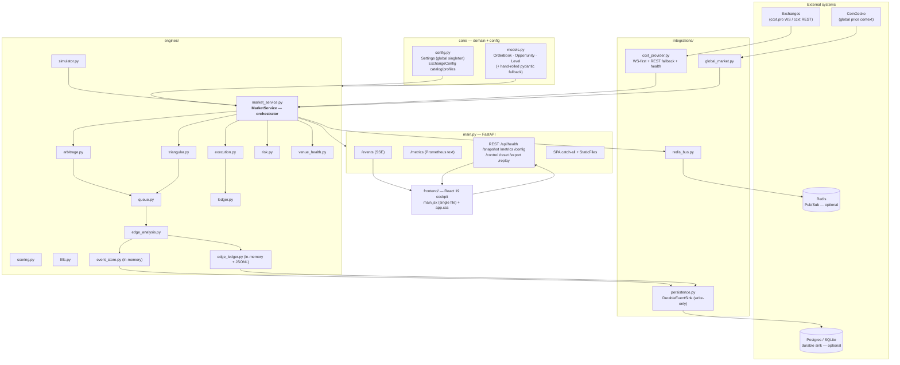
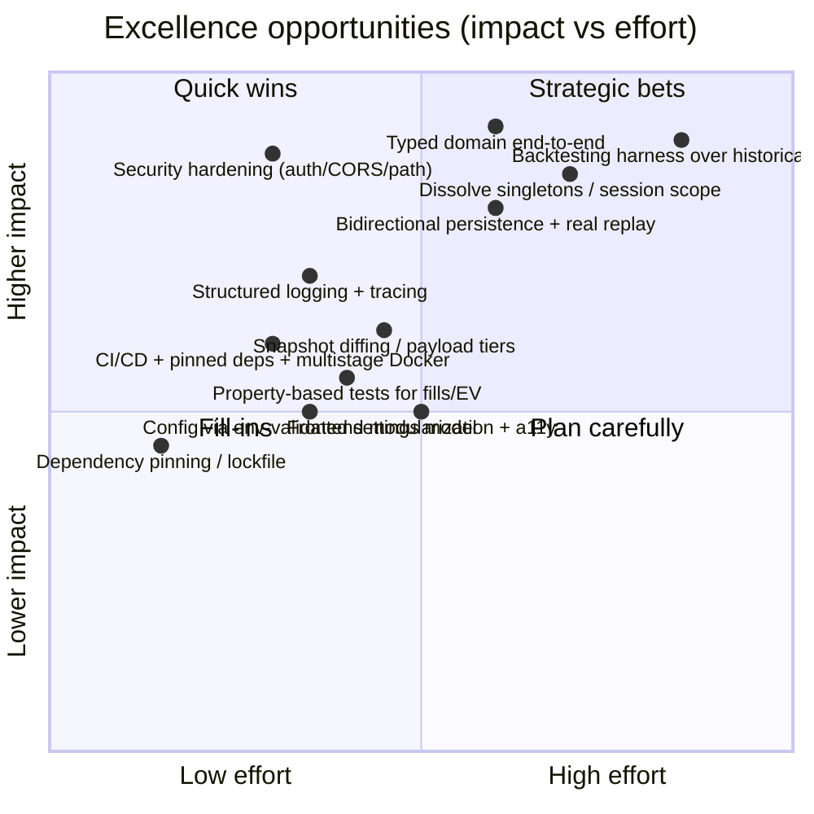

# Aurelion — Architecture Review

> **Scope of this document.** A deep, multi-perspective architecture and engineering review of
> *Aurelion*, a Bitcoin arbitrage-intelligence system and finalist (17 of 226) in the Coding
> Challenge México. It is written from six concurrent vantage points — Lead Software Architect,
> Senior Backend Engineer, Quant Developer, Trading Systems Engineer, Security Engineer, DevOps
> Engineer — plus an evaluation-committee lens.
>
> **This is analysis only.** It contains no code, no refactors, and no implementations. It
> identifies *what* and *why*, classifies opportunities by impact and effort, and explicitly marks
> anything that needs runtime verification rather than asserting it.
>
> **Method.** 100% of the source was read first-hand: all 26 Python modules under `backend/`, the
> React cockpit (`frontend/src/main.jsx`, 983 lines), the design system
> (`frontend/src/styles/app.css`, 1292 lines), the test suite (`backend/tests/test_engines.py`),
> and every infra/config file. Code references use `path:line` for traceability.

---

## Table of contents

1. [Executive summary](#1-executive-summary)
2. [Current architecture](#2-current-architecture)
3. [Strengths](#3-strengths)
4. [Weaknesses](#4-weaknesses)
5. [Risks](#5-risks)
6. [Technical debt](#6-technical-debt)
7. [Opportunities for excellence](#7-opportunities-for-excellence)
8. [Comparison vs the challenge criteria](#8-comparison-vs-the-challenge-criteria)
9. [Comparison vs a professional product](#9-comparison-vs-a-professional-product)
10. [What to keep](#10-what-to-keep)
11. [What to redesign](#11-what-to-redesign)
12. [What to rebuild only if fully justified](#12-what-to-rebuild-only-if-fully-justified)
13. [Prioritized list of improvements by impact](#13-prioritized-list-of-improvements-by-impact)
14. [Final conclusion](#14-final-conclusion)
15. [Appendix A — Open questions / needs verification](#appendix-a--open-questions--needs-verification)

---

## 1. Executive summary

Aurelion is, for a hackathon entry, an unusually *complete and honest* trading-intelligence system.
It does not fake arbitrage: it models the full decision chain — market data → normalized books →
cross-exchange and triangular/dynamic-cycle engines → expected-value scoring → priority queue with
deduplication → risk gates → simulated execution with realistic cost/latency drag → durable audit →
live dashboard. The engineering instincts on display (explainable scoring, a circuit breaker with
re-arm, venue health auto-demotion, a deterministic self-grading demo, a Prometheus endpoint, an
append-only replay ledger) are well above the median for a competition project. The README and the
"paper-trading only, no keys, no real orders" framing are mature and credible.

The gap between **"excellent hackathon project"** and **"a system that would surprise a panel of
senior engineers and survive years of product evolution"** is not about features — it is about
**three structural properties**: (1) *type safety and a real domain model* (most of the system flows
as untyped dicts once an `Opportunity` is serialized); (2) *a clean runtime/state boundary* (a
~600-line god-orchestrator plus mutable global singletons, including a `frozen` dataclass mutated via
`object.__setattr__`); and (3) *production hardening* (no auth on state-mutating endpoints, a CORS
misconfiguration, a possible path-traversal in the SPA route, unpinned dependencies, a single-stage
root Docker image, and no CI). A fourth, more subtle item undercuts the project's own "durable and
auditable" narrative: the Postgres/SQLite sink is **write-only** — nothing ever reads it back, and
"replay" is served from in-memory state, so a restart loses the session.

**Verdict.** Keep the engine decomposition and quant/risk logic — they are the soul of the product
and are genuinely good. Redesign the *seams*: introduce an end-to-end typed domain, dissolve the
global singletons, and split the monolithic snapshot/serialization path. Harden security and the
build. Make persistence bidirectional so the audit story is real. None of this requires throwing
work away; it requires turning a brilliant prototype into an engineered foundation.

**Headline scorecard (reviewer's subjective calibration):**

| Dimension | Rating | One-line justification |
|---|---|---|
| Domain/quant modeling | ★★★★☆ | Explainable EV + multi-factor cost model; a few intentional simplifications to disclose. |
| Architecture (decomposition) | ★★★★☆ | Clean layers and single-responsibility engines. |
| Architecture (runtime/state) | ★★☆☆☆ | God-orchestrator + global singletons + mutated frozen config. |
| Type safety / domain model | ★★☆☆☆ | Thin typed boundary; untyped dicts dominate. |
| Frontend | ★★★☆☆ | Strong real-time UX; monolithic; accessibility absent. |
| Security | ★★☆☆☆ | No auth, CORS misconfig, possible path traversal. |
| DevOps / reproducibility | ★★☆☆☆ | No CI, unpinned deps, single-stage root image. |
| Observability | ★★☆☆☆ | Prometheus endpoint exists; logging/tracing do not. |
| Testing | ★★★☆☆ | Good engine unit tests; no FE/integration/security tests. |
| Documentation / framing | ★★★★★ | Excellent README; honest scope. |

---

## 2. Current architecture

### 2.1 Overview

Aurelion is a single-process, single-event-loop FastAPI application. One background task (`loop()`)
drives a `tick()` every `EVALUATION_INTERVAL_MS` (default 450 ms,
`backend/app/core/config.py:104`). Each tick refreshes order books (from a deterministic simulator
in `demo` mode, or from `ccxt`/`ccxt.pro` in `auto`/`live`), runs the arbitrage engines, scores and
ranks opportunities, applies risk gates, simulates execution, and emits a full snapshot to all
connected dashboards over Server-Sent Events (SSE), optionally republished to Redis.

### 2.2 Component / layer view



*Reading note:* leaf engines have **high cohesion** and clean single responsibilities; the
**coupling concentrates** in `MarketService`, which constructs and wires every engine and owns all
mutable runtime state (`backend/app/engines/market_service.py:45-71`), and in the **module-level
global singletons** `settings` (`config.py:179`) and `market_service` (`market_service.py:596`).

### 2.3 Data-flow / tick pipeline

```mermaid
flowchart LR
  A["demo? simulator.advance()<br/>+ generate books"] --> B
  P["provider callbacks<br/>handle_book()"] --> B["self.books{}<br/>(dict keyed exchange:symbol)"]
  B --> C["primary_books() +<br/>book_summaries()"]
  C --> D["venue_health<br/>record + enrich"]
  D --> E["risk.evaluate_market()"]
  E -->|paused| Z1["empty scan +<br/>queue.pause() + snapshot"]
  E -->|ok| F["health_adjusted_books()"]
  F --> G["cross_engine.scan()<br/>+ triangular_engine.scan()"]
  G --> H["queue.rank()<br/>(dedupe + EV order)"]
  H --> I["explain_opportunity()<br/>per item"]
  I --> J["curated_opportunities()<br/>→ event_store + edge_ledger"]
  I --> K["executor.try_execute()"]
  K --> L["ledger.apply_trade()<br/>+ risk.record_trade()<br/>+ store.add_trade()"]
  J --> M["snapshot()"]
  L --> M
  M --> N["broadcast() → SSE subscribers"]
  M --> O["redis.publish() (fire-and-forget)"]
```



### 2.4 Tick sequence (control flow inside `tick()`)

```mermaid
sequenceDiagram
  participant Loop as loop()
  participant MS as MarketService.tick()
  participant Sim as SimulatedMarket
  participant VH as VenueHealth
  participant Risk as RiskManager
  participant Eng as Arb/Tri engines
  participant Q as OpportunityQueue
  participant Exe as ExecutionSimulator
  participant Sub as SSE subscribers

  Loop->>MS: tick() every 450ms
  alt demo or degraded
    MS->>Sim: advance() + generate books
  end
  MS->>VH: sync + record_books + enrich
  MS->>Risk: evaluate_market(summaries)
  alt risk paused
    MS->>Q: pause(reason)
    MS->>Sub: broadcast(snapshot) [short-circuit]
  else healthy
    MS->>Eng: scan(adjusted books)
    Eng-->>MS: opportunities[]
    MS->>Q: rank() (dedupe + EV)
    MS->>MS: explain + curate + persist
    MS->>Exe: try_execute(ranked, summaries)
    Exe-->>MS: trades[]
    MS->>Sub: broadcast(snapshot)
  end
```

### 2.5 Key runtime facts

| Aspect | Current design | Reference |
|---|---|---|
| Concurrency | One asyncio loop; `tick()` is synchronous CPU work; provider WS watch loops + Redis publishes are tasks on the same loop. | `market_service.py:205-252`, `ccxt_provider.py:119-183` |
| State ownership | All mutable state lives on the single `MarketService` instance (books, ledger, risk, store, queue, executor, health). | `market_service.py:45-72` |
| Config | Frozen dataclass `Settings`, instantiated once as a module global, **mutated at runtime** through `object.__setattr__`. | `config.py:96-179`, `market_service.py:137-138` |
| Real-time transport | SSE primary; full snapshot per tick to every subscriber; bounded queue drops oldest on overflow. | `market_service.py:568-593` |
| Domain typing | `OrderBook`/`Opportunity`/`Level` are models; everything downstream is untyped `dict`. | `core/models.py`, all engines |
| Persistence | `EventStore` + `EdgeLedger` in memory; `DurableEventSink` writes to DB but is never read back. | `event_store.py`, `edge_ledger.py`, `persistence.py` |
| Modes | `demo` (deterministic sim), `auto` (real data, degrades to demo), `live` (real data, paper execution). | `market_service.py:110-124` |

---

## 3. Strengths

These are the things a senior panel would genuinely respect.

**Architecture & code organization**
- **Layered, single-responsibility decomposition.** Fourteen focused engine modules, each doing one
  thing (`arbitrage`, `triangular`, `queue`, `scoring`, `fills`, `execution`, `ledger`, `risk`,
  `simulator`, `venue_health`, `edge_analysis`, `edge_ledger`, `event_store`). This is the project's
  best structural asset and the reason the quant logic is readable.
- **Pure, testable cores.** `fills.py`, `scoring.py`, and the engines are largely pure functions
  over inputs — easy to reason about and unit-test, which the suite exploits.

**Quant / trading modeling**
- **Explainable expected value, not naïve spread.** EV blends net profit, confidence, a latency
  *capture probability* (exponential decay by half-life), and weighted latency/volatility/inventory
  costs (`scoring.py:25-55`). The dashboard surfaces a per-route score breakdown
  (`edge_analysis.py:46-129`) — explainability is a first-class feature, not an afterthought.
- **Realistic, itemized cost stack.** Taker fee + slippage + latency-risk bps + withdrawal/rebalance
  drag at the opportunity stage (`arbitrage.py:98-157`), plus a separate **adverse-move-on-latency**
  cost at execution time (`execution.py:145-160`). The UI even contrasts *prefunded* vs *settlement*
  profitability (`edge_analysis.py:82-128`), which is exactly the nuance that separates real
  arbitrage thinking from spread-chasing.
- **Multi-strategy detection.** Cross-exchange (O(n²) pair scan), classic triangular, and *dynamic
  4-leg cycles* discovered by a bounded DFS over a per-exchange currency graph
  (`triangular.py:39-81`). The dynamic-cycle capability is a standout.

**Risk & resilience**
- **A real circuit breaker.** Volatility shock (median mid over a sliding window with min-samples and
  a re-arm interval), stale-data halt, consecutive-loss streak, and an hourly USD loss budget — with
  a manual stress button for demos (`risk.py:42-160`). It correctly keeps *observing* the market
  while halting *new* execution.
- **Venue health auto-demotion.** A scored state machine that demotes/watches/recovers venues from
  staleness, latency, REST-fallback, and disable signals, and feeds a confidence factor back into
  scoring (`venue_health.py:43-123`). This is production-grade thinking.
- **WS-first with graceful degradation.** `ccxt.pro` preferred, REST fallback after N failures, and a
  `disabled` safe state after repeated REST failures, with per-exchange safe order-book limits to
  avoid known venue quirks (`ccxt_provider.py:59-183`, `:16-21`).

**Frontend / UX**
- **Resilient real-time client.** SSE primary with automatic REST polling fallback and reconnect
  (`main.jsx:80-114`) — the right pattern, implemented cleanly.
- **Information-dense, decision-oriented cockpit.** Current-decision explainability, real-cost
  panel, priority queue, signal history with filters, executed-trade detail, wallets, SLO and
  demo-quality panels. A hand-rolled canvas P&L chart avoids a heavy dependency
  (`main.jsx:645-742`).

**Operability & honesty**
- **Prometheus `/metrics` endpoint** with proper HELP/TYPE lines (`main.py:66-91`).
- **Append-only JSONL edge ledger** for replay/inspection (`edge_ledger.py`), plus a full
  session export endpoint (`market_service.py:534-566`).
- **Deterministic, self-grading demo.** A seeded simulator with engineered cross/triangular/dynamic/
  volatility shocks (`simulator.py:13-83`) and a `demo_quality` grader that flags "too-hot" or
  "too-quiet" cadence (`edge_analysis.py:190-238`). This is a thoughtful answer to the judge's
  experience.
- **Excellent README and honest framing** (paper-only, no keys, no real orders).

---

## 4. Weaknesses

Ordered roughly by structural impact.

### 4.1 The domain degrades to untyped dicts (dominant architectural weakness)
Only the *input* boundary is typed. The moment `Opportunity.to_dict()` runs
(`core/models.py:121-141`), every downstream consumer — queue, scoring annotations, execution,
edge analysis, the frontend — operates on raw dicts with string keys and positional knowledge:
`opportunity["costs"]["buyFee"]`, `trade["sellQuote"]`, `item.get("dynamicCycle")`. This is
fragile (a renamed key is a silent runtime `KeyError`), undocumented (the dict's shape lives only in
the code that builds it), and hostile to refactoring and onboarding. For a system that aspires to
multi-year evolution, this is the single most important thing to address.

### 4.2 God-orchestrator + global singletons
`MarketService` (~600 lines) constructs and owns *everything* and is instantiated as a module-level
global (`market_service.py:596`); `settings` is likewise a global (`config.py:179`). Consequences:
- **Testing requires building the whole world** (the tests construct `MarketService` to exercise a
  cycle).
- **No multi-tenant / multi-session isolation**: all dashboards share one mutable session; one
  user's `/api/reset` or mode change affects everyone.
- **Horizontal scale is blocked**: state is in-process, so multiple workers/replicas would diverge.

### 4.3 A frozen dataclass mutated at runtime
`Settings` is `@dataclass(frozen=True)` yet `set_active_exchanges()` rewrites `settings.exchanges`
and `settings.active_exchanges` via `object.__setattr__` (`market_service.py:137-138`), and
`__post_init__` does the same (`config.py:165-170`). This defeats the immutability contract and is
**racy**: a request mutating the shared global while a tick reads it can produce inconsistent scans.

### 4.4 Snapshot/serialization is heavy and recomputed
`snapshot()` (`market_service.py:386-502`) builds a large dict with many comprehensions and is
invoked **multiple times per cycle**: inside `tick()`, again inside `metrics_snapshot()`,
`export_session()`, `trigger_volatility_stress()`, and once per SSE connection
(`event_stream():585-593`). The full snapshot is JSON-serialized and pushed to *every* subscriber
each tick with no diffing or payload tiering. It works at 5 venues; it will not scale linearly with
venues × symbols × subscribers.

### 4.5 Synchronous compute on the event loop
`tick()` runs the O(n²) cross scan and the triangular DFS synchronously on the single loop
(`market_service.py:236`, `arbitrage.py:30-37`, `triangular.py:51-81`). Heavy ticks block SSE
delivery and the provider's WS watch loops. There is no offloading to threads/processes and no
budget/timeout on a tick.

### 4.6 Persistence is one-way (audit-credibility gap)
`DurableEventSink` writes opportunities/trades/events to Postgres or SQLite
(`persistence.py:82-105`) but **no code reads from it**. The `/api/replay` endpoint and session
export are served from the **in-memory** `EdgeLedger`/`EventStore`. So the system's central
"durable, auditable, replayable" claim is only half-true: a restart loses the session, and the
durable store is effectively a write-only log. The narrative and the implementation diverge.

### 4.7 Observability is shallow
There is no structured logging anywhere — the only stdout is a `print()` banner (`main.py:178`).
Failures across integrations are caught by broad `except Exception` and reduced to a status string
(`persistence.py:51-54,103-105`, `redis_bus.py:26-29,37-39`, `global_market.py:61-63`,
`ccxt_provider.py:138-149`), and `edge_ledger` write errors are silently `pass`-ed
(`edge_ledger.py:36-37`). The Prometheus endpoint exists but coverage is minimal (six series) and
there is no tracing, no request logging, no error aggregation.

### 4.8 Frontend: monolith + accessibility
- One 983-line `main.jsx` with ~30 components and all helpers inline — readable but unmodular, no
  code-splitting, no error boundary, no tests.
- **Accessibility is essentially absent**: zero `aria-*`, zero `role=`, zero `:focus`/
  `focus-visible` styling, no `alt` text across `main.jsx` and `app.css` (verified by search).
  Notably, the repo *ships* an `.agents/skills/accessibility` skill that was never applied.
- Only two responsive breakpoints (1320 px, 760 px). A stray Spanish string in an otherwise English
  UI ("Esperando el primer trade", `main.jsx:738`).

### 4.9 Quant simplifications worth disclosing (not bugs, but evaluators will ask)
- **Triangular trades do not move base inventory.** `ledger.apply_trade()` for a triangular trade
  only credits `netProfit` to USDT and increments realized P&L; the reported `qtyBtc`/`qtyEth` are
  never applied to balances (`ledger.py:122-127`). Cross trades, by contrast, correctly conserve BTC
  and move USDT by exactly `netProfit`.
- **Pooled "rebalanced" liquidity is optimistic.** Route capacity can pool BTC/USDT across *all*
  active wallets as if instantly transferable (`ledger.py:43-58`); the cost of that is modeled only
  as a P&L line, not as a balance/time penalty in the physical rebalance
  (`ledger.py:88-120`).
- **P&L baseline uses current marks.** `totals()` computes `startingValue` from *current* mark
  prices, so "total P&L" intentionally strips BTC price drift but mixes mark-to-market with realized
  cash (`ledger.py:139-167`). Defensible, but should be stated.

---

## 5. Risks

A register framed as likelihood × impact, with the dominant ones first.

| # | Risk | Likelihood | Impact | Notes / reference |
|---|---|---|---|---|
| R1 | **No auth on state-mutating endpoints.** Anyone who can reach the server can change mode, toggle execution, trigger stress, or reset the shared session. | High (if exposed) | High | `main.py:137-153` |
| R2 | **CORS misconfiguration:** `allow_origins=["*"]` with `allow_credentials=True` (an invalid/insecure combination browsers reject). | High | Medium | `main.py:35-41` |
| R3 | **Possible path traversal** in the SPA catch-all: `FileResponse(FRONTEND_DIST / full_path)` with no containment check. **Needs verification** (Starlette may normalize `..`). | Unknown | High if real | `main.py:165-172` |
| R4 | **Shared global mutable state** → no session isolation, no horizontal scale, restart loses everything. | High | High | `market_service.py:596`, `config.py:179` |
| R5 | **External-dependency fragility:** `ccxt`/exchange WS often geo/IP-blocked or rate-limited; CoinGecko unauthenticated with a 4 s timeout and no caching/back-off. | Medium | Medium | `ccxt_provider.py`, `global_market.py:65-76` |
| R6 | **Durability illusion:** durable sink is write-only; replay/export come from memory. A restart or crash loses the "auditable" session. | High | Medium | `persistence.py`, `market_service.py:99-102` |
| R7 | **Event-loop blocking** under more venues/symbols/subscribers degrades real-time delivery and WS health simultaneously. | Medium (at scale) | Medium | `market_service.py:236`, `event_stream` |
| R8 | **Non-reproducible builds:** unpinned `requirements.txt` (`>=`) and `^` frontend ranges; a future transitive bump can break the build silently. | Medium | Medium | `requirements.txt`, `frontend/package.json` |
| R9 | **Docker/deploy build fragility:** Node installed via Debian apt on `python:3.12-slim` (likely Node 18) while Vite 7 wants Node ≥ 20; `render.yaml` uses `env: python` but builds with `npm`. **Needs verification.** | Medium | Medium | `Dockerfile:5`, `render.yaml:6` |
| R10 | **Unbounded fire-and-forget tasks** for Redis publish with no exception handling/back-pressure. | Low | Low–Medium | `market_service.py:317-323` |
| R11 | **No rate limiting / request-size limits**; `ControlPayload` accepts arbitrary `activeExchanges` lists and `mode` strings (mode is validated; list length is bounded only downstream). | Medium | Low–Medium | `main.py:44-49`, `market_service.py:125-141` |

---

## 6. Technical debt

| Area | Debt item | Why it matters | Reference |
|---|---|---|---|
| Typing | Untyped dict domain after `to_dict()` | Silent breakage, poor discoverability, refactor friction | `core/models.py:121-141`, all engines |
| Config | `frozen=True` mutated via `object.__setattr__` | Breaks contract; racy under concurrency | `market_service.py:137-138`, `config.py:165-170` |
| State | Module-level singletons (`settings`, `market_service`) | No isolation/scale; test-unfriendly | `config.py:179`, `market_service.py:596` |
| Packaging | `sys.path.append(getusersitepackages())` hack in two modules | Masks a packaging/env problem; surprising | `main.py:8-10`, `models.py:7-9` |
| Models | Hand-rolled `BaseModel` fallback when pydantic is missing | Two code paths; the fallback validates nothing | `models.py:11-59` |
| Persistence | Write-only sink; never queried | Dead durability; misleading capability | `persistence.py`, no reader |
| Logging | No structured logging; broad `except` swallowing | Hard to diagnose in prod | many integrations; `main.py:178` |
| Frontend | 983-line single file; no tests; no a11y | Onboarding + maintainability + inclusivity | `frontend/src/main.jsx`, `app.css` |
| Scripts | Dead `test:legacy` → non-existent `tests/*.test.js` | Confusing; rots | `package.json:14` |
| Licensing | `MIT` declared in `package.json` but no `LICENSE` file | Legal ambiguity | repo root |
| Repro | Unpinned Python deps, no lockfile | Non-deterministic builds | `requirements.txt` |
| Duplication | `now_ms()` / `rounded()` redefined in many engines | Minor DRY drift | e.g., `arbitrage.py:13-18`, `triangular.py:13-18`, `risk.py:10-11` |
| Snapshot | `snapshot()` recomputed several times per cycle | Wasted CPU; one source of truth missing | `market_service.py` (multiple call sites) |

---

## 7. Opportunities for excellence

These are the moves that would make a senior panel lean forward. Classified by **impact** (product/
engineering signal) and **effort**. No implementations — directions only.

### Impact × effort matrix



### Highlighted opportunities

1. **End-to-end typed domain (strategic).** Make the `Opportunity`/`Trade`/`Snapshot` shapes
   first-class typed objects through the whole pipeline, with a single serialization boundary at the
   API edge. This is the highest-leverage change for long-term evolution and is what most clearly
   separates "prototype" from "engineered system."
2. **Session/runtime as an injectable service (strategic).** Replace the module-global orchestrator
   and settings with constructed, injectable instances and per-session (or per-tenant) state. Unlocks
   isolation, real tests without building the world, and a path to horizontal scale.
3. **A real backtesting / replay harness (strategic, marquee).** The system already produces a
   durable event stream and a deterministic simulator — turning the *write-only* sink into a
   queryable store and feeding it back through the same engines would yield genuine backtesting and
   true replay. This is the feature that would most impress a quant-aware panel and is the natural
   "year one" product capability for a fintech.
4. **Security hardening (high impact, low effort).** Auth on mutating endpoints, fix the CORS combo,
   constrain the static-file route, add rate limits and input bounds. Cheap, and removes the most
   embarrassing findings.
5. **Observability spine.** Structured, leveled logging with correlation IDs; expand Prometheus
   coverage (tick duration, queue depth, per-engine timings, error counters); optional OpenTelemetry
   traces. Trading systems live or die on this.
6. **Snapshot tiering + diffing.** Separate "hot" (prices, decisions) from "cold" (config, catalog)
   payloads and push deltas; compute the snapshot once per tick. Directly improves scalability and
   perceived latency.
7. **Engineering hygiene that reads as professionalism.** GitHub Actions running tests + lint +
   build on every push; pinned deps/lockfiles; a multi-stage non-root Docker image with a
   HEALTHCHECK; a `LICENSE` file; `.env.example`. Individually small, collectively a strong signal.
8. **Frontend componentization + accessibility.** Split `main.jsx`, add an error boundary and
   tests, and apply the accessibility skill already in the repo (focus states, ARIA, keyboard
   semantics). Inclusivity is increasingly a committee criterion.
9. **Property-based and golden tests for the quant core.** `fills`, `scoring`, and the cost stack
   are pure and ideal for property-based testing (e.g., fills never exceed depth; EV monotonicity).
   High confidence per line of test.

---

## 8. Comparison vs the challenge criteria

> **Open question (stated explicitly):** the *official* rubric for the Coding Challenge México is
> **not present in the repository**. The assessment below uses an **inferred, clearly-labeled**
> hackathon rubric plus the project's own stated goals (speed, financial reasoning, failure
> handling, visual clarity, traceability, clean code). Treat the weighting as illustrative.

| Inferred criterion | How Aurelion does | "Does it meet?" | "Would it *surprise* a senior panel?" |
|---|---|---|---|
| **Functionality / completeness** | Full decision chain, three modes, multi-strategy detection, live dashboard, export/replay. | ✅ Strongly | ✅ Yes — breadth + the dynamic-cycle engine. |
| **Technical difficulty** | WS-first data with fallback, EV scoring, circuit breaker, venue health, deterministic sim. | ✅ Strongly | ✅ Yes — depth is unusual for a hackathon. |
| **Financial reasoning** | Itemized costs, prefunded vs settlement, latency capture probability, risk budget. | ✅ Strongly | ✅ Yes — this is the project's strongest "wow." |
| **Failure handling / resilience** | Reconnect, REST fallback, disable safe-state, stale/volatility/loss/budget gates. | ✅ Strongly | ◐ Mostly — undercut by no auth and one-way persistence. |
| **Visual clarity / UX** | Dense, decision-oriented cockpit; explainability; resilient SSE client. | ✅ Yes | ◐ Mostly — striking, but a11y gaps and monolith. |
| **Traceability / auditability** | Edge ledger (JSONL), session export, Prometheus. | ✅ Yes | ◐ Partial — "durable" store is write-only. |
| **Code quality / cleanliness** | Clean engine decomposition; but untyped dicts, singletons, mutated frozen config. | ◐ Mixed | ✗ Not yet — the seams would draw scrutiny. |
| **Innovation** | Self-grading demo, dynamic cycles, explainable EV. | ✅ Yes | ✅ Yes. |
| **Production readiness** | No CI, no auth, single-stage root image, unpinned deps. | ✗ No | ✗ No — clearly a prototype underneath. |

**Net.** Against a typical hackathon rubric, Aurelion **comfortably clears "meets"** on most axes and
**surprises** on functionality, technical depth, financial reasoning, and innovation — consistent
with finalist status. Where it would *not* yet surprise a senior panel is **code-quality seams** and
**production readiness**. Those are precisely the axes this review targets, and they are fixable
without touching the parts that already shine.

---

## 9. Comparison vs a professional product

What a production fintech trading-intelligence platform would have that Aurelion does not yet.

| Capability | Professional baseline | Aurelion today | Gap |
|---|---|---|---|
| AuthN/AuthZ | SSO/RBAC, signed sessions, per-action authorization | None on mutating endpoints | Large |
| Multi-tenancy / isolation | Per-user/org state, quotas | Single shared global session | Large |
| Domain model | Typed, versioned schemas, validation | Typed at edge, dicts within | Large |
| Persistence | Queryable, migrated, read+write, retention | Write-only sink; memory truth | Large |
| Backtesting | Historical replay, scenario libraries | Deterministic sim only; no historical | Medium–Large |
| Observability | Structured logs, traces, dashboards, alerts | Print + 6 Prometheus series | Large |
| Reliability/HA | Multi-replica, health checks, graceful drain | Single process, in-memory state | Large |
| Security posture | Secrets mgmt, dependency scanning, SAST, rate limits | Env vars only; none of the rest | Large |
| CI/CD | Test+lint+build+scan gates, releases | None | Large |
| Reproducible builds | Pinned deps, lockfiles, SBOM | Unpinned Python | Medium |
| Frontend rigor | Componentized, tested, accessible, i18n | Monolith, no tests, no a11y | Medium–Large |
| Real execution | Order routing, smart order placement, reconciliation | Paper simulation (by design) | N/A (intentional) |
| Compliance/audit | Immutable, queryable audit; access logs | One-way log; no access logs | Medium |

**Framing for the owner:** none of these gaps are surprising for a hackathon artifact — and several
(no real execution) are *correct* choices for the contest. The point is that the **conceptual model
is already that of a professional product**; what is missing is the **engineering substrate**
(types, isolation, persistence, security, observability, CI). That is an encouraging position: the
hard, creative part is done.

---

## 10. What to keep

Preserve these — they are the product's identity and competitive edge.

- **The engine decomposition** and the pure-function cores (`fills`, `scoring`, engines).
- **The quant model**: explainable EV, the itemized cost stack, prefunded-vs-settlement, latency
  capture probability.
- **The risk subsystem**: circuit breaker with re-arm, stale/loss/budget gates, manual stress.
- **Venue health auto-demotion** feeding confidence back into scoring.
- **WS-first + REST fallback + disable safe-state** data strategy and per-exchange safe limits.
- **The deterministic, self-grading demo** — a genuinely smart answer to evaluation UX.
- **The resilient SSE-with-REST-fallback frontend pattern** and the decision-oriented panels.
- **Prometheus endpoint, edge ledger (as a concept), session export.**
- **The README and the honest paper-only framing.**
- **The existing engine unit-test suite** — extend it, don't replace it.

---

## 11. What to redesign

Re-shape these *without discarding the logic inside them*.

1. **The domain typing boundary.** Carry typed objects through the pipeline; serialize once at the
   API edge. (Biggest long-term win.)
2. **State & configuration ownership.** Replace module-global `settings`/`market_service` with
   injectable, constructed instances; introduce per-session state; eliminate the
   `object.__setattr__` mutation of a frozen dataclass (config changes should produce a *new*
   immutable config, not mutate a shared one).
3. **The snapshot/serialization path.** Compute once per tick; split hot vs cold payloads; consider
   deltas. Make `snapshot()` not the catch-all it is today.
4. **Error handling & observability.** Replace broad swallowing + `print` with structured, leveled
   logging and meaningful Prometheus/trace coverage.
5. **Security surface.** Add auth/authorization on mutating endpoints, fix CORS, constrain static
   file serving, add input/rate limits.
6. **Build & deploy.** Multi-stage, non-root, pinned, health-checked Docker; pinned Python deps/
   lockfile; CI gates.
7. **Frontend structure.** Componentize, add an error boundary and tests, and apply accessibility.

---

## 12. What to rebuild only if fully justified

Reserve these for when there is a concrete need — do **not** rebuild speculatively.

- **The persistence layer into a queryable, bidirectional store** — justified the moment
  backtesting, true replay, or cross-restart durability becomes a product requirement (it is the
  natural first "real" feature, but it is a rebuild, not a tweak).
- **The concurrency/execution model** (separating compute from I/O, or moving to worker processes)
  — justified only when venue/symbol/subscriber scale actually blocks the loop; premature today.
- **Redis from "optional fan-out" into a real producer/consumer backbone** — justified only if you
  move to a multi-process or multi-service topology; today SSE is sufficient and Redis is a nice-to-
  have.
- **Replacing the hand-rolled pydantic fallback / canvas chart with libraries** — justified only if
  they become maintenance burdens; today they are reasonable, dependency-light choices.

---

## 13. Prioritized list of improvements by impact

Ranked for a team that wants maximum *senior-panel + product* signal per unit of effort. (Tiers, not
a schedule — and still **no implementations**, just direction.)

**Tier 1 — Highest impact, do first (cheap or foundational)**
1. **Security hardening**: auth on `/api/control` & `/api/reset`; fix CORS wildcard+credentials;
   constrain the SPA static route; add input/rate limits. *(High impact, low effort.)*
2. **Engineering hygiene as signal**: CI (test+lint+build), pin Python deps/lockfile, multi-stage
   non-root Docker + HEALTHCHECK, add `LICENSE` and `.env.example`, remove the dead `test:legacy`
   script. *(High signal, low effort.)*
3. **Make persistence bidirectional (read path) and align the "durable/auditable" claim** — at
   minimum, serve replay/export from the durable store so a restart doesn't erase the session.
   *(High credibility impact.)*

**Tier 2 — Structural, highest long-term leverage**
4. **End-to-end typed domain** with a single serialization boundary.
5. **Dissolve global singletons; introduce session-scoped, injectable state/config**; remove the
   mutated-frozen-config hack.
6. **Observability spine**: structured logging + expanded metrics (tick duration, queue depth,
   per-engine timings, error counters).

**Tier 3 — Scale & polish**
7. **Snapshot tiering/diffing + compute-once-per-tick.**
8. **Frontend modularization, error boundary, tests, and accessibility.**
9. **Property-based / golden tests** for `fills`, `scoring`, and the cost stack; add SSE/API
   integration tests.

**Tier 4 — Marquee differentiator (plan carefully)**
10. **Backtesting / true-replay harness** over the (now queryable) event store, reusing the existing
    engines and deterministic simulator — the feature most likely to impress a quant-aware panel and
    the natural first product capability.

**Tier 5 — Disclosure & correctness polish**
11. Document (and optionally tighten) the quant simplifications: triangular inventory not moved,
    pooled-liquidity optimism, current-mark P&L baseline.

---

## 14. Final conclusion

Aurelion is a **strong finalist for the right reasons**: it demonstrates real financial reasoning,
genuine multi-strategy detection (including dynamic cycles), a credible risk subsystem, thoughtful
resilience, and an evaluation experience that was clearly designed, not improvised. The *conceptual*
architecture is already that of a serious trading-intelligence product, and the clean engine
decomposition means the valuable logic is well-contained and worth preserving wholesale.

The distance to "a system that surprises senior engineers and can evolve for years" is not a feature
distance — it is an **engineering-substrate distance**: an end-to-end typed domain instead of untyped
dicts; injectable, session-scoped state instead of global singletons and a mutated frozen config; a
split, compute-once snapshot path; a real security posture; an observability spine; reproducible
builds and CI; and — most pointedly — a persistence layer that actually closes the loop on the
"durable and auditable" promise. Each of these is achievable without disturbing the quant and risk
cores that already shine.

If the owner treats this not as "polish a hackathon entry" but as "lay the first stone of a fintech
platform," the priorities are clear: **harden and professionalize the seams first (Tier 1–2), then
invest in the backtesting/replay capability (Tier 4) that the system is already 70% of the way
toward.** The creative, hard-to-fake part — the modeling — is done well. What remains is the
disciplined, learnable work of turning a brilliant prototype into an engineered foundation.

---

## Appendix A — Open questions / needs verification

Per the "never assume" constraint, these are stated as **questions**, not findings:

1. **SPA path traversal** (`main.py:165-172`): is `/{full_path:path}` exploitable, or does Starlette
   normalize `..` before the handler? Needs a runtime probe to confirm/deny.
2. **Docker Node version** (`Dockerfile:5`): does Debian-apt Node on `python:3.12-slim` satisfy Vite
   7 / `engines: node>=20`, or does the image build warn/fail? Needs a build run.
3. **Render build** (`render.yaml:6`): is `npm` actually available in Render's `env: python` build
   image? Needs a deploy check.
4. **`auto`/`live` connectivity**: do exchange WS/REST endpoints connect from the grader's network,
   or do they get geo/IP-blocked (forcing the documented safe degradation to demo)?
5. **Official challenge rubric**: not in the repo — Section 8 uses an inferred rubric. Supplying the
   real criteria would let the comparison be made exact.
6. **Postgres path**: the durable Postgres branch (`persistence.py:31-54`) is untested in the suite;
   its behavior under a real `DATABASE_URL` needs verification.

---

*Prepared as a read-only architecture review. No source files were modified.*
